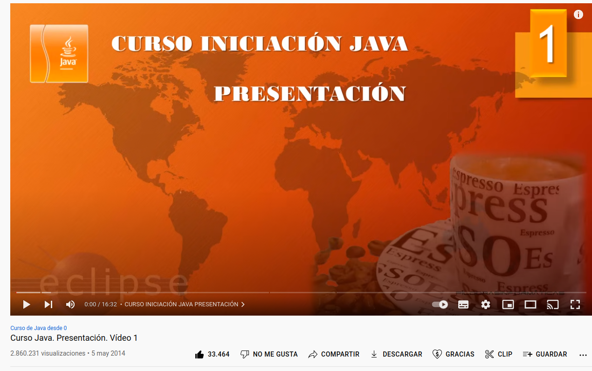

# JAVA  COURSE -    PILDORAS INFORMATICAS - 

# CHAT - COMMON

 

 

In this project we made a library with the common code that we will 
use in two related projects: Client and Server, where we will work 
with Sockets.

 

We will work with the exercises of the course on YouTube named as "Curso Java " by "Pildoras Informaticas".